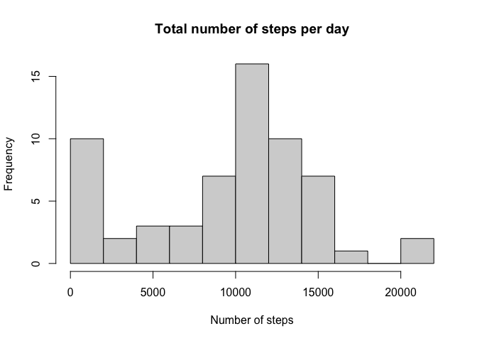
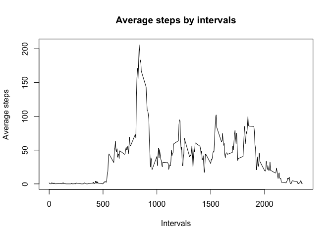
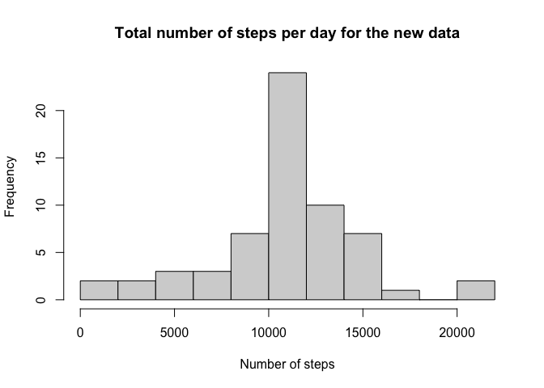
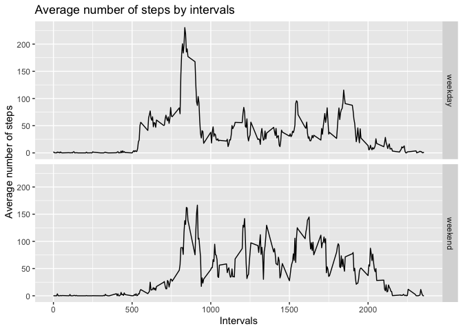

## Loading and preprocessing the data
First we load the document from the zip file and convert dates from string to date format.

```r
activity <- read.csv(unz("activity.zip","activity.csv"))
activity$date <- as.Date(activity$date, "%Y-%m-%d")
```

## What is mean total number of steps taken per day?
We calcualte the total numnber of steps per day.

```r
total_steps <- tapply(activity$steps, activity$date, sum, na.rm=TRUE)
```

The histogram of the total number of steps per day is shown below.

```r
hist(total_steps, breaks = 15, main = "Total number of steps per day", xlab = "Number of steps")
```

<!-- -->

The following R code calculates mean and median of total number of steps taken per day.

```r
mean_steps = mean(total_steps)
median_steps = median(total_steps)
```
Mean of the total steps taken per day is 9354.2295082 and median is 10395.

## What is the average daily activity pattern?
First we calculate the average steps per day for the given intervals.

```r
average_steps = aggregate(steps ~ interval, activity, FUN = mean)
```

Now, we plot the time series plot.

```r
with(average_steps, plot(steps ~ interval, type="l", xlab="Intervals", ylab = "Average steps",main="Average steps by intervals"))
```

<!-- -->

Finding the interval with maximum number of steps.

```r
interval_max <- average_steps[average_steps$steps==max(average_steps$steps),1]
```

The interval with maximum average number of steps is 835.

## Imputing missing values
Number of missing values are counted with the following code.

```r
nof_missing <- sum(is.na(activity$steps))
```
There are 2304 missing observations.

Replacing missing step values with the averages by interval.

```r
library(dplyr)
```

```
## 
## Attaching package: 'dplyr'
```

```
## The following objects are masked from 'package:stats':
## 
##     filter, lag
```

```
## The following objects are masked from 'package:base':
## 
##     intersect, setdiff, setequal, union
```

```r
impute.mean <- function(x) replace(x, is.na(x), mean(x, na.rm=TRUE))
activity_new <- activity %>% group_by(interval) %>% mutate(steps = impute.mean(steps))
```

We calcualte the total numnber of steps per day for the new data.

```r
total_steps_new <- tapply(activity_new$steps, activity_new$date, sum, na.rm=TRUE)
```

The histogram of the total number of steps per day for the new data is shown below.

```r
hist(total_steps_new, breaks = 15, main = "Total number of steps per day for the new data", xlab = "Number of steps")
```

<!-- -->

The following R code calculates mean and median of total number of steps taken per day.

```r
mean_steps_new = mean(total_steps_new)
median_steps_new = median(total_steps_new)
```
The new mean of the total steps taken per day is 1.0766189\times 10^{4}, it was 9354.2295082 before. The new median is 1.0766189\times 10^{4}, while it was 10395 before. Both mean and median are increased.

## Are there differences in activity patterns between weekdays and weekends?

Creating a variable which identifies whether the day is a weekday or a weekend.

```r
activity_new$weekdays <- weekdays(activity_new$date)
activity_new$week <- ifelse(activity_new$weekdays %in% c("Saturday", "Sunday"), "weekend", "weekday")
activity_new$week <- as.factor(activity_new$week)
```

Creating a dataset for the plot.

```r
average_steps_new = aggregate(steps ~ interval + week, activity_new, FUN = mean)
```

Plotting time series.

```r
library(ggplot2)
ggplot(average_steps_new, aes(x=interval, y=steps)) + geom_line() + facet_grid(week~.) + labs(title="Average number of steps by intervals", y="Average number of steps", x="Intervals")
```

<!-- -->
